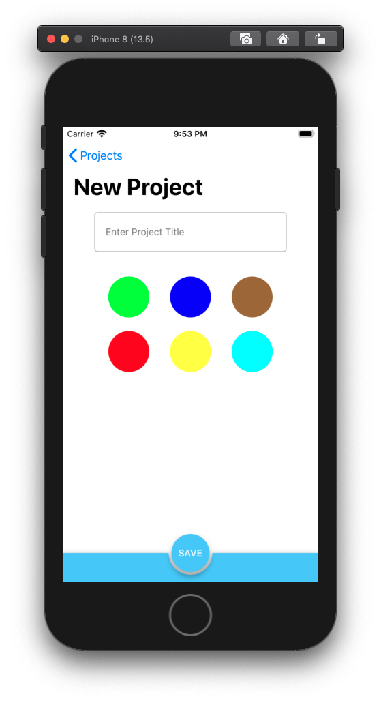
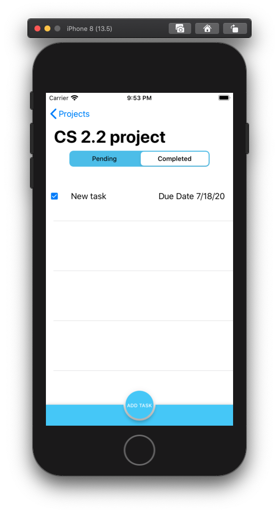
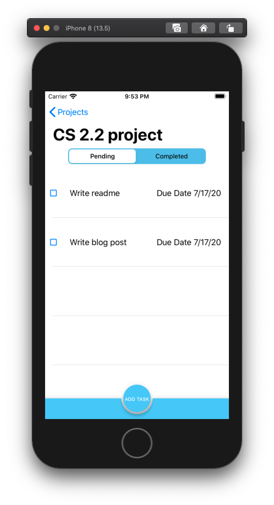
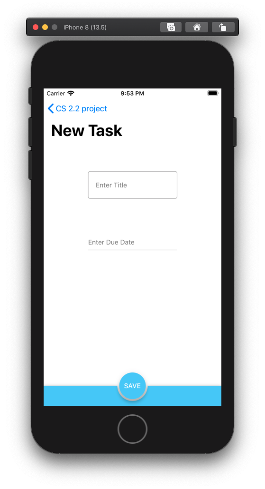

# Taskee
Final Project for Make School MOB2.1 local persistance

Built using Core Data, UIKit, and the Material Components library

# Features
Ability to add a project with a title and a color tag

Ability to add tasks to specific projects with title and due date

Ability to mark tasks as completed or uncompleted

Ability to delete projects and tasks

# Material Components
[Here](https://github.com/nickKearns/Taskee/blob/master/Podfile) is the pod file to install Material Components

[Here](https://material.io/develop/ios) is Material Components' site for iOS development

# Download Link
Project can be downloaded using this [link](https://github.com/nickKearns/Taskee/archive/master.zip)

# Code 
[Here](https://github.com/nickKearns/Taskee/tree/master/Taskee/view%20controllers) is the link to the view controllers used in this project

[Here](https://github.com/nickKearns/Taskee/tree/master/Taskee/models) is the link to the models used in this project

[Here](https://github.com/nickKearns/Taskee/tree/master/Taskee/views) is the link to the views (such as custom cell classes) used in this project

[Here](https://github.com/nickKearns/Taskee/blob/master/Taskee/models/TaskeeStore.swift) is a link to the core data file that contains the code that builds the core data stack

# Project views

# Tasks View

# Create A Task

